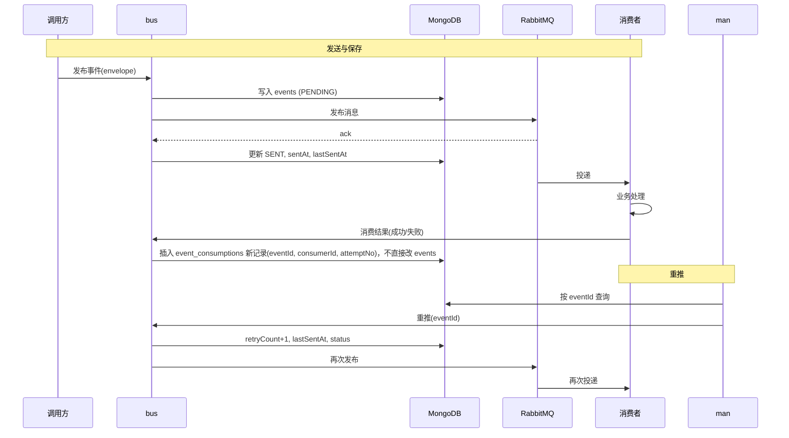

# 事件与存储设计说明

本文档说明**事件的结构**、**事件存储的结构**，以及事件的**发送、保存、重试、关联**全流程。与 [需求文档](./requirements.md) 配套，作为实现 bus / man 的数据与流程依据。

---

## 1. 事件的结构

### 1.1 概念区分

- **业务载荷（Payload）**：业务方关心的具体数据，如订单号、用户 ID、操作类型等，结构由业务定义，系统以不透明字节或 JSON 存储。
- **事件元数据（Metadata）**：系统为调度、追溯、重试而附加的字段，由 bus/man 统一约定。

下面所说的「事件」指**系统层面的事件 envelope**：元数据 + 载荷。

### 1.2 事件统一结构（Envelope）

在 RabbitMQ 消息体与 MongoDB 持久化中，事件采用统一信封结构，便于发送、存储与关联。

| 字段 | 类型 | 必填 | 说明 |
|------|------|------|------|
| **eventId** | String | 是 | 全局唯一事件 ID（如 UUID），用于去重、重试、关联。 |
| **traceId** | String | 推荐 | 分布式链路 ID，同一次业务触发的多条事件/调用共享，用于串联「事件调用链路」。 |
| **spanId** | String | 可选 | 当前环节的 span ID，与 traceId 一起构成链路节点。 |
| **parentEventId** | String | 可选 | 若本事件由另一事件的消费所触发，则填上游事件的 eventId，用于父子关联。 |
| **topic** | String | 是 | 逻辑主题，对应 RabbitMQ 的 routing key 或交换机路由，如 `order.created`、`payment.notify`。 |
| **payload** | Object / String / Binary | 是 | 业务载荷，JSON 对象或序列化字符串；消费端按 topic 约定反序列化。 |
| **payloadType** | String | 可选 | 载荷类型提示，如 `application/json`、`application/cloudevents+json`。 |
| **initiator** | Object | 推荐 | 发起方信息，见下。 |
| **occurredAt** | String (ISO-8601) | 是 | 事件发生时间（业务发生时间或首次发送时间）。 |
| **sentAt** | String (ISO-8601) | 可选 | 首次发送到 MQ 的时间，由 bus 在发送时写入。 |
| **expireAt** | String (ISO-8601) | 可选 | 业务过期时间，超过后可不再重试或不再展示。 |

**initiator（发起方）** 建议结构：

| 字段 | 类型 | 说明 |
|------|------|------|
| **service** | String | 发起服务名，如 `order-service`、`bus`。 |
| **operation** | String | 操作/接口，如 `createOrder`、`POST /api/orders`。 |
| **userId** | String | 若可识别，填用户 ID。 |
| **clientRequestId** | String | 客户端请求 ID，便于与业务日志关联。 |

示例（JSON）：

```json
{
  "eventId": "evt-a1b2c3d4-e5f6-7890-abcd-ef1234567890",
  "traceId": "trace-xxx-001",
  "spanId": "span-001",
  "parentEventId": null,
  "topic": "order.created",
  "payload": { "orderId": "ORD-2024-001", "amount": 99.00 },
  "payloadType": "application/json",
  "initiator": {
    "service": "order-service",
    "operation": "createOrder",
    "userId": "user-123",
    "clientRequestId": "req-abc-001"
  },
  "occurredAt": "2024-02-28T10:00:00Z",
  "sentAt": "2024-02-28T10:00:01Z"
}
```

---

## 2. 事件存储的结构（MongoDB）

### 2.1 集合设计

事件及链路数据存放在 **同一逻辑库**（如 `wx-bus`），bus 与 man 均可访问（或由 man 只读 + 重推写）。集合划分如下：

| 集合名 | 用途 |
|--------|------|
| **events** | 事件主表：每条事件一条文档，仅包含 envelope + **发送/重试相关状态**（如 PENDING/SENT/RETRYING）。**不**在此文档内嵌消费反馈，避免多消费者并发更新同一文档导致写冲突与状态不一致。 |
| **topic_consumers** | **Topic–消费者配置表**：维护每个 topic 对应哪些消费者，支持**动态配置**（增删改消费者无需发版）。事件创建时根据该 topic 的配置**初始化** event_consumptions 的「预期消费者」记录，见 2.3。 |
| **event_consumptions** | 消费反馈表：**无** (eventId, consumerId) 唯一约束；同一消费者多次回调各保留一条记录（attemptNo 递增），便于问题排查。记录来源：① **事件创建时**按 topic_consumers 预插（attemptNo=0、success=null）；② 消费者**每次回调**插入新记录。通过 eventId 与 events 关联；汇总时按 (eventId, consumerId) 取最新一条参与计算，见 2.3、2.5、2.6。 |
| **event_links**（可选） | 若需将「链路」单独建模为边表，可存 (eventId, parentEventId, traceId, sequence)；多数场景仅用 events 内字段即可。 |

这样设计可避免：多个消费者同时回调时对同一 events 文档做 read-modify-write 带来的并发更新与状态覆盖问题。

### 2.2 events 文档结构

在 1.2 的 envelope 基础上，增加**存储与状态**字段：

| 字段 | 类型 | 说明 |
|------|------|------|
| **_id** | ObjectId | MongoDB 主键；也可用 eventId 作为 _id 便于幂等写入。 |
| **eventId** | String | 同 1.2，唯一，建议建唯一索引。 |
| **traceId** | String | 同 1.2，建索引便于按链路查询。 |
| **spanId** | String | 同 1.2。 |
| **parentEventId** | String | 同 1.2，建索引便于查「某事件的子事件」。 |
| **topic** | String | 同 1.2，必建索引（列表/筛选）。 |
| **payload** | Object / String | 同 1.2。 |
| **payloadType** | String | 同 1.2。 |
| **initiator** | Object | 同 1.2，可按 initiator.service 等建复合索引。 |
| **occurredAt** | Date | 建议存为 Date，便于范围查询。 |
| **sentAt** | Date | 首次发送时间。 |
| **expireAt** | Date | 可选。 |
| **status** | String | 见 2.4，必建索引。由「发送/重推」直接更新，或由 **event_consumptions** 聚合后异步/单独更新，见 2.6。 |
| **statusAt** | Date | 最近一次状态变更时间（发送、重推或汇总消费状态时更新）。 |
| **retryCount** | Integer | 重试次数（含首次发送为 0，每次重推 +1）。 |
| **lastSentAt** | Date | 最近一次投递到 MQ 的时间（含重推）。 |
| **createdAt** | Date | 文档创建时间。 |
| **updatedAt** | Date | 文档最后更新时间。 |

**说明**：消费反馈不写入 events 文档，统一写入 **event_consumptions** 表并通过 eventId 关联，避免多消费者并发更新 events 导致冲突；events.status 的消费相关取值（CONSUMED/PARTIAL/FAILED）由 event_consumptions 聚合得到。

### 2.3 Topic–消费者配置表（topic_consumers）

用于维护 **topic 与消费者的关联**，支持**动态配置**：新增/下线某 topic 的消费者时只需改配置表（或通过 man 管理界面），无需发版。事件创建时会**读取该表并初始化** event_consumptions，见 3.2。

**topic_consumers 文档结构**：

| 字段 | 类型 | 说明 |
|------|------|------|
| **_id** | ObjectId | MongoDB 主键。 |
| **topic** | String | 事件 topic，与 events.topic 一致，如 `order.purchased`、`trade.payment.success`。 |
| **consumerId** | String | 消费者唯一标识，如 `member-service`、`message-service`。 |
| **enabled** | Boolean | 是否启用；仅 enabled=true 的配置会在事件创建时参与初始化。 |
| **sortOrder** | Integer | 可选，展示或初始化顺序。 |
| **description** | String | 可选，消费者说明。 |
| **createdAt** | Date | 配置创建时间。 |
| **updatedAt** | Date | 配置最后更新时间。 |

**唯一约束**：`(topic, consumerId)` 唯一，同一 topic 下同一消费者只保留一条配置。

**使用方式**：

- **配置维护**：通过 man 或直接写库增删改 topic_consumers；例如为 `order.purchased` 配置 `member-service`、`message-service`，新事件创建时即会为这两个消费者预插 event_consumptions 记录。
- **事件创建时初始化反馈**：写入 events 后，根据该事件的 **topic** 查询 topic_consumers（enabled=true），为每个 consumerId 插入一条 **event_consumptions** 记录：eventId=当前事件、consumerId=配置项、**success=null**（表示待消费）、consumedAt 为空、**attemptNo=0**（表示初始化）。后续消费者**每次回调**均**新增**一条 event_consumptions 记录（attemptNo 递增），不覆盖旧记录，便于保留多次重试/回调历史、方便问题排查；汇总「当前状态」时按 (eventId, consumerId) 取**最新一条**（attemptNo 最大或 consumedAt 最新）参与计算。管理端可区分「预期消费者数」与「已反馈数」，并展示「2/2 已消费」或「1/2 已消费」等，且可查看每个消费者的多次回调明细。

若某 topic 在 topic_consumers 中**无配置**（或全为 enabled=false）：**记录 ERROR 日志、不抛异常、终止发送**（不写入 events、不发布 MQ），防止未配置消费者的 topic 被发出，且**不影响调用方主流程**，见 3.2。

### 2.4 状态（status）枚举

| 取值 | 含义 | 可迁转方向 |
|------|------|------------|
| **PENDING** | 已创建未发送（先落库后发 MQ 时，写入 events 后、发布 MQ 前为该状态）。 | → SENT |
| **SENT** | 已发送到 RabbitMQ，尚未确认消费结果。 | → CONSUMED, PARTIAL, FAILED, RETRYING |
| **CONSUMED** | 已成功消费并确认（单消费者全部成功，或多消费者全部成功）。 | — |
| **PARTIAL** | 多消费者场景下，部分成功、部分失败。 | → CONSUMED, FAILED, RETRYING |
| **FAILED** | 消费失败或发送失败，不再自动重试。 | → RETRYING（人工/管理端重推） |
| **RETRYING** | 正在重试（如已再次投递到 MQ）。 | → SENT, CONSUMED, PARTIAL, FAILED |
| **EXPIRED** | 已过期（若有 expireAt）。 | — |

状态变更时更新 **status**、**statusAt**；与消费相关的状态（CONSUMED/PARTIAL/FAILED）不通过对 events 的 read-modify-write 直接改，而是由 **event_consumptions** 聚合后更新（见 2.5、2.6），从而避免并发写冲突。

### 2.5 消费反馈表（event_consumptions）

消费反馈**不入 events 文档**，全部写入独立集合 **event_consumptions**，通过 **eventId** 与 events 关联。**不设** (eventId, consumerId) 唯一约束：同一消费者对同一事件的**多次回调各保留一条记录**，便于问题排查（如重试 3 次、3 条错误信息均可查看）。

- 每个消费者回调时**仅插入新记录**，不更新已有记录，不存在多线程写同一文档的并发问题。
- 单消费者与多消费者模型统一：同一 (eventId, consumerId) 可有多条记录（初始化 1 条 + 每次回调 1 条），汇总「当前状态」时按 (eventId, consumerId) 取**最新一条**参与计算。

**event_consumptions 文档结构**：

| 字段 | 类型 | 说明 |
|------|------|------|
| **_id** | ObjectId | MongoDB 主键。 |
| **eventId** | String | 关联 events.eventId，必建索引。 |
| **consumerId** | String | 消费者唯一标识，如 `member-service`、`message-service`。单消费者场景可固定为同一值（如 `default`）。 |
| **attemptNo** | Integer | 同一 (eventId, consumerId) 下的序号：**0** 表示事件创建时按 topic_consumers 初始化的「待消费」记录；**1, 2, 3…** 表示第 1、2、3 次回调。用于排序与取「最新一次」反馈。 |
| **success** | Boolean / null | 该次是否消费成功；**null** 仅用于 attemptNo=0 的初始化记录（待消费）。 |
| **consumedAt** | Date | 该次消费完成时间；初始化记录可为 null。 |
| **errorMessage** | String | 失败时错误信息。 |
| **errorCode** | String | 可选，业务错误码。 |
| **createdAt** | Date | 记录创建时间。 |

**无唯一约束**。记录来源：① **事件创建时**按 topic_consumers 为每个 consumerId 插入一条（attemptNo=0、success=null）；② 消费者**每次回调**均**插入**一条新记录，attemptNo 为该 (eventId, consumerId) 下当前最大值+1。同一消费者多次重试/回调会形成多行，管理端可按时间或 attemptNo 查看完整历史，便于排查。

**与 events.status 的汇总关系**：  
按 eventId 查出所有 event_consumptions 后，先按 (eventId, consumerId) 取**最新一条**（attemptNo 最大，或 consumedAt 非空中取最大）；再按这些「当前」记录的 success 汇总：全部 success=true 且无待消费(null) → CONSUMED；存在 success=false → PARTIAL 或 FAILED；存在 success=null（仅初始化记录）→ 仍可视为 SENT（等待中）或展示「已反馈数/预期数」。汇总结果**不**在消费回调路径上直接写回 events，而是由 2.6 的**异步回写**（专用 topic 串行）回写 events。

### 2.6 状态更新与并发（events.status）

**问题**：若多个消费者同时回调，都在 events 上做「读当前 status/consumptions → 计算新 status → 写回」，会产生竞态与覆盖，且 events 文档会因内嵌数组频繁变更而膨胀。

**做法**：

1. **消费反馈只写 event_consumptions，且每次回调插入新记录**  
   各消费者（或 bus 代写）每次回调向 event_consumptions **插入**一条新记录（attemptNo 递增），不更新已有记录，不修改 events。

2. **events 上仅允许两类更新，且互不叠加**  
   - **发送/重推侧**：仅更新与「发送」相关的字段（如 status=PENDING→SENT、retryCount、lastSentAt、statusAt）。由 bus 单点或按 eventId 串行化后执行，避免并发。  
   - **消费汇总侧**：仅更新「由消费结果推导出的 status」（CONSUMED/PARTIAL/FAILED）及 statusAt。不在此文档上做数组 push 等复杂更新。

3. **消费汇总采用「异步回写」实现，使用独立 topic/队列串行处理**  
   - **实现方式**：消费反馈写入 event_consumptions 后，向**消费汇总专用 topic（队列）**投递一条轻量消息（如 payload 仅含 eventId），由该 topic 的**单一消费者**串行消费：根据 eventId 查询 event_consumptions、按 (eventId, consumerId) 取最新一条并汇总出 status（CONSUMED/PARTIAL/FAILED 或等待中），再对 events 做一次 status + statusAt 的更新。  
   - **专用 topic**：与业务事件 topic 区分，由项目约定命名（如 `bus.consumption-rollup`、`internal.status-rollup`），单独队列、单独消费者，不与业务消费混用。  
   - **串行保证**：该 topic 仅部署**一个消费者**（或同一消费者组内单实例），保证「汇总回写」在同一时刻只处理一条消息，对 events 的更新不并发，同一 eventId 的汇总只由一处执行。  
   - **流程简述**：写入 event_consumptions → 发送 eventId 到消费汇总专用 topic → 汇总消费者消费 → 查 event_consumptions 聚合 → 更新 events.status、statusAt。

### 2.7 索引建议

**events**：

```javascript
db.events.createIndex({ eventId: 1 }, { unique: true })
db.events.createIndex({ status: 1, occurredAt: -1 })
db.events.createIndex({ topic: 1, occurredAt: -1 })
db.events.createIndex({ traceId: 1, occurredAt: 1 })
db.events.createIndex({ "initiator.service": 1, occurredAt: -1 })
db.events.createIndex({ parentEventId: 1 })
// db.events.createIndex({ expireAt: 1 }, { expireAfterSeconds: 0 })
```

**topic_consumers**（按 topic 查配置，供事件创建时初始化 event_consumptions）：

```javascript
db.topic_consumers.createIndex({ topic: 1, consumerId: 1 }, { unique: true })
db.topic_consumers.createIndex({ topic: 1, enabled: 1 })
```

**event_consumptions**（与 events 关联、按消费者查询、按 (eventId, consumerId) 取最新一条；无唯一约束，同一消费者多次回调多行）：

```javascript
db.event_consumptions.createIndex({ eventId: 1 })
db.event_consumptions.createIndex({ eventId: 1, consumerId: 1, attemptNo: -1 })  // 取某消费者在某事件下的最新反馈
db.event_consumptions.createIndex({ eventId: 1, consumerId: 1, consumedAt: -1 }) // 或按时间取最新
db.event_consumptions.createIndex({ consumerId: 1, consumedAt: -1 })
```

---

## 3. 事件的发送

### 3.1 发送时机与职责

- **发送**由 **bus** 完成：将事件发布到 RabbitMQ，并在 MongoDB 中写入/更新事件记录。
- **采用「先落库后发 MQ」**：先以 PENDING 写入 MongoDB（并初始化 event_consumptions），再发布到 RabbitMQ，成功后更新为 SENT。便于「至少存一次」、重推时从库中取完整 envelope，且与消费反馈、重推流程一致。

### 3.2 发送流程（简要）

1. **生成/校验 envelope**：生成 `eventId`（若未提供）、`occurredAt`、`sentAt`，校验 `topic`、`payload`、`initiator` 等。
2. **校验 topic_consumers 配置**：根据本事件的 **topic** 查询 **topic_consumers**（enabled=true）。若**无任何启用中的消费者配置**，则**打印 ERROR 日志**（如记录 topic、eventId 等）、**不抛异常**，**终止本次发送**（不写入 events、不发布 MQ），直接返回，**不影响调用方主流程**；调用方可在配置 topic_consumers 后重试或通过其他途径处理。
3. **写入 MongoDB（events + 初始化消费反馈）**：  
   - 插入 **events** 文档，status = **PENDING**。  
   - **初始化 event_consumptions**：为步骤 2 查到的每个 consumerId 插入一条 **event_consumptions** 记录：eventId=当前事件、consumerId=配置项、**attemptNo=0**、**success=null**、consumedAt=null（表示待消费）。  
4. **发布到 RabbitMQ**：按 `topic` 路由到对应 exchange/queue，消息体为序列化后的 envelope（或仅 payload + 必要元数据，由实现约定）。
5. **更新发送状态**：发布成功后，更新 events 的 status = **SENT**，写入 sentAt、lastSentAt，retryCount 保持 0（首次）。

发送失败（如 MQ 不可用）时：已落库的 events 保持 PENDING 或置为 FAILED，并记录错误信息，便于 man 重推；已初始化的 event_consumptions 记录保留，便于管理端展示「预期消费者」与后续真实反馈对比。

### 3.3 与「关联」的关系

- 发送时若调用方传入 **traceId/spanId/parentEventId**，应原样写入 envelope 和 MongoDB，用于后续「事件调用链路」展示。
- **initiator** 在发送时由调用方传入或由 bus 从当前上下文（服务名、请求 ID）补全，用于「事件发起方」展示。

---

## 4. 事件的保存

### 4.1 保存发生的时机

| 时机 | 写入位置 | 内容 |
|------|----------|------|
| **发送前/后** | events | 完整 envelope + status（PENDING/SENT）、sentAt、lastSentAt、retryCount、createdAt/updatedAt。 |
| **消费确认后** | **event_consumptions** | **插入**一条新记录（eventId、consumerId、attemptNo 递增、success、consumedAt、errorMessage 等），不覆盖已有记录，便于保留多次回调历史。**不**直接改 events 文档。随后向**消费汇总专用 topic** 投递 eventId，由该 topic 的异步回写消费者串行聚合后更新 events.status（见 2.6）。 |
| **重推时** | events | 仅更新 retryCount、lastSentAt、status（→ RETRYING/SENT）、statusAt。 |
| **人工/定时过期** | events | 更新 status = EXPIRED、statusAt。 |

### 4.2 幂等与唯一性

- **events**：以 **eventId** 唯一标识一条事件；eventId 唯一索引，插入时若已存在则按策略忽略或更新发送相关字段，**不**在 events 上做消费反馈的 read-modify-write。
- **event_consumptions**：**无** (eventId, consumerId) 唯一约束；同一消费者对同一事件**每次回调插入一行**（attemptNo 递增），历史可查、便于排查，且无并发更新 events 的问题。
- 发送到 RabbitMQ 时，可根据 eventId 做去重；消费端按 eventId（及 consumerId）做业务幂等。

### 4.3 谁负责写 MongoDB

- **bus**：发送时写 **events**，并据 **topic_consumers** 初始化 **event_consumptions**（见 3.2）；消费端回调或 MQ 确认时只写 **event_consumptions**，并投递 eventId 到**消费汇总专用 topic**。events 的消费汇总 status 按 2.6 由该 topic 的**异步回写消费者**串行聚合后回写。
- **man**：读 **events** 与 **event_consumptions**（列表/详情可做关联或聚合）；重推时只更新 **events** 的 retryCount、lastSentAt、status 等，由 bus 或 man 单点执行。

---

## 5. 重试与重推

### 5.1 概念区分

- **自动重试**：消费失败后由 MQ 或 bus 自动重新投递（如 RabbitMQ 重入队、DLQ 再投递），次数与策略可配置。
- **人工/管理端重推**：在 **man** 上对某条事件（如 FAILED 或 SENT 超时未消费）执行「重推」，再次将该事件投递到 RabbitMQ。

本文档侧重 **管理端重推**；自动重试策略可与 RabbitMQ 的 prefetch、nack、DLQ 等配合，由 bus 配置实现。

### 5.2 重推条件（建议）

- status 为 **FAILED** 或 **RETRYING**；或 **SENT** 且超过一定时间未变为 CONSUMED（超时未消费）。
- 若存在 **expireAt**，则重推时检查未过期再推。
- 可选：限制单条事件最大重推次数，超过则不再允许重推。

### 5.3 重推流程

1. **man** 接收重推请求（如按 eventId）。
2. **man** 从 MongoDB 根据 eventId 查出完整事件文档（envelope）。
3. **man** 调用 bus 的重推接口，或直接向 RabbitMQ 发布该事件（若 man 具备 MQ 客户端权限）；推荐通过 bus 统一发布，便于审计与计数。
4. **bus**（或 man）将事件再次发布到 RabbitMQ，并更新 MongoDB：
   - **retryCount** += 1；
   - **lastSentAt** = 当前时间；
   - **status** = RETRYING 或 SENT。
5. 消费端再次消费后，按 4.1 向 **event_consumptions** **插入**该消费者的一条新记录（attemptNo 递增），并投递 eventId 到消费汇总专用 topic；events 的汇总 status 由该 topic 的异步回写消费者串行回写（见 2.6）。

### 5.4 幂等与重复消费

- 重推使用**同一 eventId**，消费端应基于 eventId 做幂等处理（如先查已处理再执行业务），避免重复扣款、重复发通知等。
- 存储侧同一 eventId 只对应一条文档，重推只更新该文档，不新增文档。

---

## 6. 关联：发起方与事件调用链路

### 6.1 事件发起方

- **initiator** 即发起方信息，在发送时写入 envelope 与 MongoDB。
- **man** 列表/详情可展示：initiator.service、initiator.operation、initiator.userId、initiator.clientRequestId，并支持按 initiator.service 等筛选。
- 若发送时未传 initiator，可由 bus 用默认值（如当前服务名、当前请求 ID）补全，保证「总能展示发起方」。

### 6.2 事件调用链路

- **traceId**：同一次业务触发的多个事件/步骤共享同一 traceId，用于「按链路聚合」。
- **parentEventId**：若事件 A 的消费逻辑里又发送了事件 B，则 B 的 parentEventId = A.eventId，形成父子关系。
- **spanId**：同一 trace 下不同节点的唯一标识，便于在界面上画成树或时间线。

展示方式建议：

- **按 traceId 查询**：列出该 traceId 下所有事件，按 occurredAt 或 span 顺序排序，展示为时间线或树（父 → 子）。
- **按 eventId 查详情**：展示该事件 + 其 parent（parentEventId）及子事件（parentEventId = 当前 eventId），即「上下游」各一层或多层。

存储上不强制 event_links 表；用 events 的 traceId、parentEventId、eventId 即可通过查询实现「链路」与「树形」展示。

### 6.3 关联关系小结

| 关系 | 存储字段 | 用途 |
|------|----------|------|
| 发起方 | initiator | 谁/哪个服务/哪个操作发起了事件 |
| 同链路 | traceId | 哪些事件属于同一次业务过程 |
| 父子事件 | parentEventId ↔ eventId | 谁触发了谁（下游由上游消费触发） |
| 同链路顺序 | spanId + occurredAt | 链路内节点顺序与并行关系 |

---

## 7. 典型场景：一源多消费者（购买成功 → 会员积分 + 消息通知）

### 7.1 场景描述

- **业务**：用户 A 购买商品成功。
- **期望**：同一笔购买需要触发多个下游动作且互不阻塞：
  - **会员服务**：根据订单金额增加积分；
  - **消息服务**：发送通知（站内信/短信/推送等）。

要求事件设计能**兼容「一个业务事件、多个独立消费者」**：发一次事件，会员与消息各自消费、各自可追溯、各自可重试，且能在管理端看到完整链路（谁发起的、谁消费了、谁又触发了子事件）。

### 7.2 事件设计（兼容多消费者）

**原则**：一条业务事实只对应**一条系统事件**（一个 eventId），payload 携带**所有消费者都可能需要**的公共信息；各消费者按需取用，不要求 payload 为某单一消费者定制。

- **topic**：用业务含义命名，与「有多少个消费者」无关。例如：`order.purchased` 或 `trade.payment.success`。
- **payload**：包含订单、用户、金额等公共字段，供会员服务算积分、消息服务填模板。建议至少包含：
  - `orderId`、`userId`、`amount`、`occurredAt`（或订单完成时间）；
  - 可选：`channel`、`productIds`、`quantity` 等，按业务约定。
- **initiator**：填写发起方，如 `service: "order-service"`, `operation: "confirmOrder"`, `userId: "user-A"`，便于在 man 中看到「用户 A 购买成功」是谁发起的。

示例 payload（仅示例，可按业务扩展）：

```json
{
  "orderId": "ORD-2024-002",
  "userId": "user-A",
  "amount": 199.00,
  "currency": "CNY",
  "occurredAt": "2024-02-28T10:05:00Z",
  "channel": "app"
}
```

会员服务只关心 userId、amount 等；消息服务只关心 userId、orderId、amount 等；两者**共用同一 payload**，无需为每个消费者发不同事件。

### 7.3 消息路由（RabbitMQ 一事件多队列）

同一事件需要被**会员服务**和**消息服务**各自消费一次，且互不影响（一个失败不影响另一个）。推荐两种方式二选一：

| 方式 | 说明 |
|------|------|
| **Fanout 交换机** | 订单服务将事件发到 fanout exchange，该 exchange 绑定队列 `member-service.order.purchased`、`message-service.order.purchased`；每个队列一份消息，各消费者独立消费、独立 ack。 |
| **Topic 交换机 + 多 binding** | 使用同一 topic（如 `order.purchased`），两个队列用相同或不同 binding key 订阅该 topic；broker 将消息复制到每个队列。 |

无论哪种方式，**存储侧只存一条事件文档**（一个 eventId）：该事件被投递到多个队列，但仍是「同一条事件」；消费反馈通过 **event_consumptions** 表按消费者区分；预期消费者由 **topic_consumers** 配置并在事件创建时初始化（见 2.3、2.5、7.4）。

### 7.4 存储与状态（多消费者）

- **events** 表仍是一条文档对应一条业务事件（一次「用户 A 购买成功」对应一个 eventId）；**不**在 events 文档内嵌 consumptions，避免多消费者并发更新同一文档。
- **event_consumptions** 表按 (eventId, consumerId) **可有多条记录**（无唯一约束），例如该 eventId 下：

| eventId | consumerId       | attemptNo | success | consumedAt           |
|---------|------------------|-----------|--------|----------------------|
| evt-001 | member-service   | 0         | null   | null（初始化）        |
| evt-001 | member-service   | 1         | true   | 2024-02-28T10:05:02Z |
| evt-001 | message-service  | 0         | null   | null（初始化）        |
| evt-001 | message-service  | 1         | false  | 2024-02-28T10:05:03Z |
| evt-001 | message-service  | 2         | true   | 2024-02-28T10:05:10Z（重试成功） |

汇总时按 (eventId, consumerId) 取 **attemptNo 最大**（或 consumedAt 最新）的一条参与计算；管理端可查看每个消费者的**多次回调历史**，便于排查重试与错误信息。

- **events.status** 的汇总规则（见 2.4、2.6）：按 (eventId, consumerId) 取最新一条后聚合 —— 全部 success=true 且无待消费(null) → **CONSUMED**；存在 success=false → **PARTIAL** 或 **FAILED**；存在 success=null 可视为等待中。汇总结果由**消费汇总专用 topic** 的异步回写消费者串行处理并回写 events，不在消费回调路径上直接改 events。

这样在管理端可以：看「这条购买事件」的总状态（来自 events 或实时聚合），并关联 **event_consumptions** 展开「会员服务已成功、消息服务失败」等明细及**每次回调的 attemptNo/时间/错误信息**，便于按消费者排查与重试。

### 7.5 子事件与链路（同一 traceId、parentEventId）

会员服务、消息服务在**处理完**该事件后，若会再产生下游事件（如「积分已增加」「通知已发送」），应作为**子事件**发送，以便在 man 中形成完整链路：

- **父事件**：`order.purchased`（eventId = evt-purchase-001，traceId = trace-001）。
- **子事件 1**：会员服务发送 `points.added`，携带 `parentEventId = evt-purchase-001`，**traceId = trace-001**（与父一致），payload 可含 userId、points、sourceEventId 等。
- **子事件 2**：消息服务发送 `notification.sent`，携带 `parentEventId = evt-purchase-001`，**traceId = trace-001**，payload 可含 userId、channel、templateId 等。

这样在「事件调用链路」中可按 traceId 展示为：  
`order.purchased` → `points.added`、`order.purchased` → `notification.sent`（两条并行分支），且能看出都源自同一次「用户 A 购买成功」。

### 7.6 重推策略（按需按消费者）

- **整事件重推**：对 eventId 重推时，事件会再次投递到**所有**订阅了该 topic 的队列，会员和消息都会再收一次；各消费者需按 eventId（+ 自身 consumerId）做幂等，避免重复加积分、重复发通知。
- **按消费者重推（可选）**：若 man 支持「仅对某消费者重推」，则需总线或 MQ 支持按队列/消费者定向投递（例如单独发到 message-service 的队列）；存储上该消费者再次回调时会**新插入**一条 **event_consumptions** 记录（attemptNo 递增），历史可查。当前文档以「整事件重推」为主，按消费者重推可作为扩展实现。

### 7.7 小结（兼容性要点）

| 维度 | 设计要点 |
|------|----------|
| **事件条数** | 一次业务事实 = 一条事件（一个 eventId），不按消费者拆成多条。 |
| **Payload** | 设计成多消费者可共用的公共信息，便于扩展更多下游（如风控、统计）。 |
| **路由** | RabbitMQ 一事件多队列（fanout 或 topic 多 binding），每个消费者独立 ack。 |
| **存储** | **events** 仅存事件与发送态；消费反馈存 **event_consumptions** 表，通过 eventId 关联；汇总 status 采用**异步回写**，经**专用 topic 串行**更新 events（见 2.6），避免并发更新。 |
| **链路** | 子事件用同一 traceId + parentEventId，便于「购买 → 积分、通知」同链展示。 |
| **重推与幂等** | 重推同一 eventId，各消费者按 eventId（+ consumerId）做幂等。 |

---

## 8. 流程总览（Mermaid）

以下为「发送 → 存储 → 消费 → 状态更新」与「重推」的简化流程。




---

**文档版本**：v0.4  
**状态**：设计说明，供实现 bus / man 时参考。若后续有字段或流程变更，请同步更新本文档与 [需求文档](./requirements.md)。

- **一源多消费者**场景（如：购买成功 → 会员积分 + 消息通知）见 **第 7 节**。
- **消费反馈**存 **event_consumptions** 独立表，与 events 通过 eventId 关联，避免状态更新并发问题，见 **2.1、2.5、2.6**。
- **event_consumptions 无 (eventId, consumerId) 唯一约束**：同一消费者多次回调**各插入一条记录**（attemptNo 递增），历史可查、便于问题排查；汇总时按 (eventId, consumerId) 取最新一条，见 **2.5**。
- **Topic–消费者配置表 topic_consumers**：维护 topic 与消费者关联，支持动态配置；**事件创建时**据该表初始化 event_consumptions（预期消费者），见 **2.3、3.2**。
